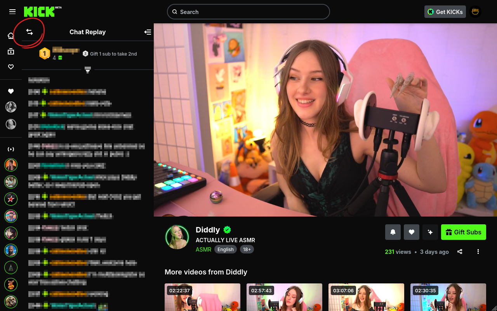

# Left Kick

Left Kick allows you to move Kick livestream chats to the left or right side.

## Usage
Click the switch button shown above to move the chat to the other side. The chat settings at the bottom also contains a "Left Kick" button with the same functionality.